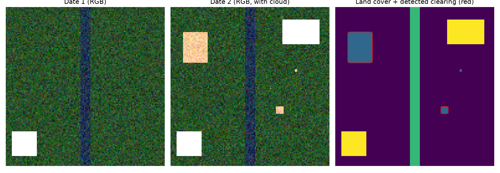
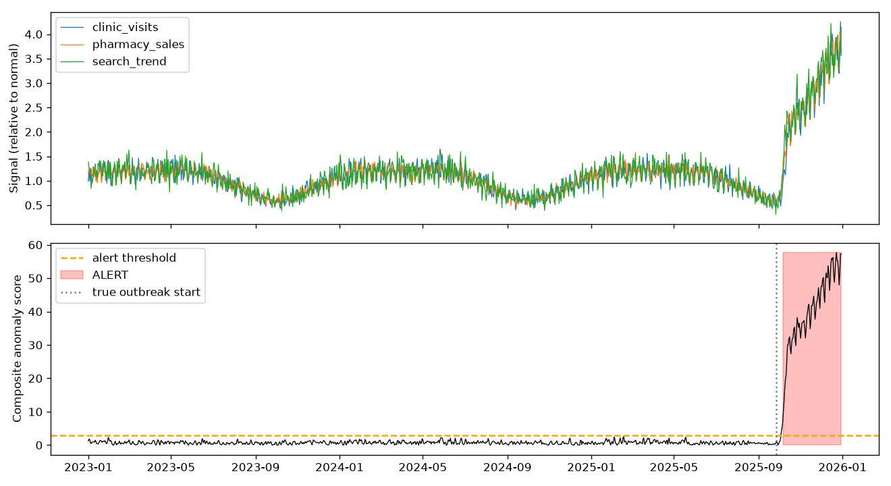

# AI & ML in the Real World — 5 Problems, 5 Working Prototypes

**Author:** Thandra Tejaswini

Working code for five real-world problems that can be solved or improved with AI/ML.
Each module is a small, runnable prototype of the system proposed in the project report.

| # | Problem | Technique | Folder |
|---|---------|-----------|--------|
| 1 | Early detection of crop diseases | CNN (MobileNetV2 transfer learning), outbreak alerts | `01_crop_disease/` |
| 2 | Fraud detection in online payments | Gradient boosting + Isolation Forest, risk tiers | `02_fraud_detection/` |
| 3 | Illegal deforestation monitoring | Pixel classification / U-Net + change detection | `03_deforestation/` |
| 4 | Fake job posting detection | NLP: TF-IDF + Logistic Regression + red-flag explanations | `04_fake_job_detection/` |
| 5 | Community disease-outbreak early warning | Time-series baseline + anomaly detection | `05_outbreak_warning/` |

## Run each project

Modules 2–5 run immediately on built-in synthetic data:

```bash
cd 02_fraud_detection      && python fraud_detection.py
cd 03_deforestation        && python deforestation.py
cd 04_fake_job_detection   && python fake_job_detector.py
cd 05_outbreak_warning     && python outbreak_warning.py
```

Results (models, CSV alerts, plots) are written to `outputs/`.

**Module 1 needs a dataset** — download [PlantVillage](https://www.kaggle.com/datasets/emmarex/plantdisease)
and place it as `data/plantvillage/<class_name>/*.jpg`, then:

```bash
cd 01_crop_disease
python train.py --data ../data/plantvillage --epochs 5
python predict.py --image path/to/leaf.jpg --lat 17.38 --lon 78.48
```

## Using real data

- **Fraud:** replace `make_data()` with the Kaggle *Credit Card Fraud Detection* dataset.
- **Fake jobs:** `python fake_job_detector.py --csv data/fake_job_postings.csv` (Kaggle *Real / Fake Job Posting Prediction*).
- **Deforestation:** export Sentinel-2 tiles from Google Earth Engine and replace `make_scene` logic with real arrays.
- **Outbreak:** replace `make_data()` with anonymised clinic / pharmacy / search-trend CSVs.

## Limitations

Synthetic-data demos score near-perfectly because the patterns are simple; real data will be harder.
As noted in the report, every system is a **decision-support tool** to work alongside human experts
(extension officers, fraud analysts, forest officers, moderators, health authorities), not a replacement.

## Sample Results



